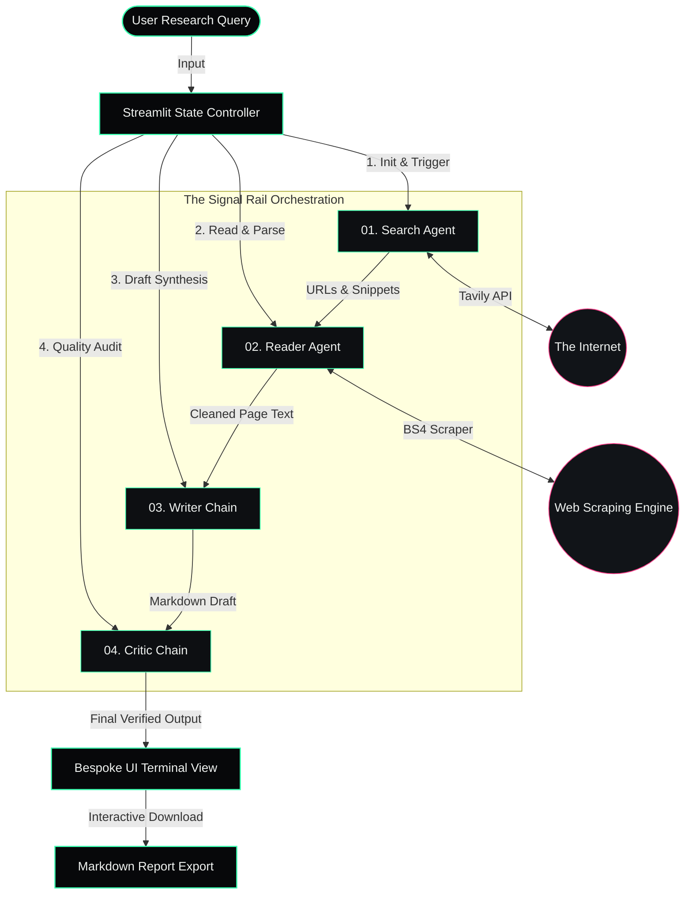
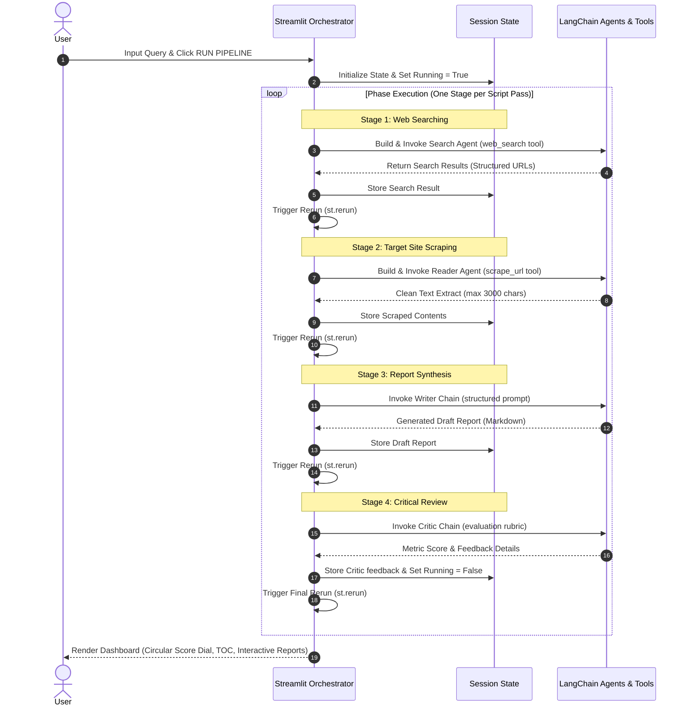
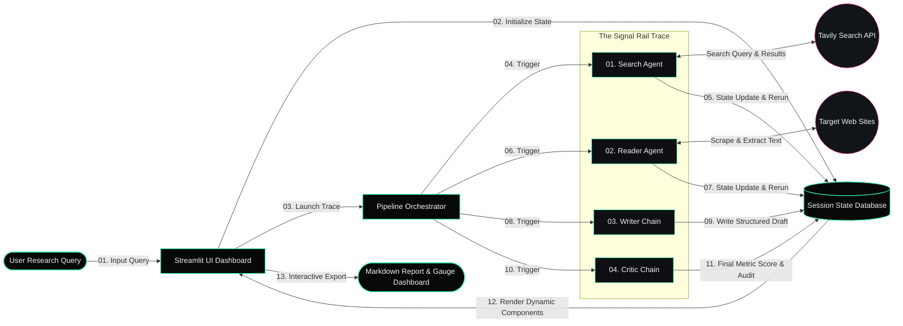
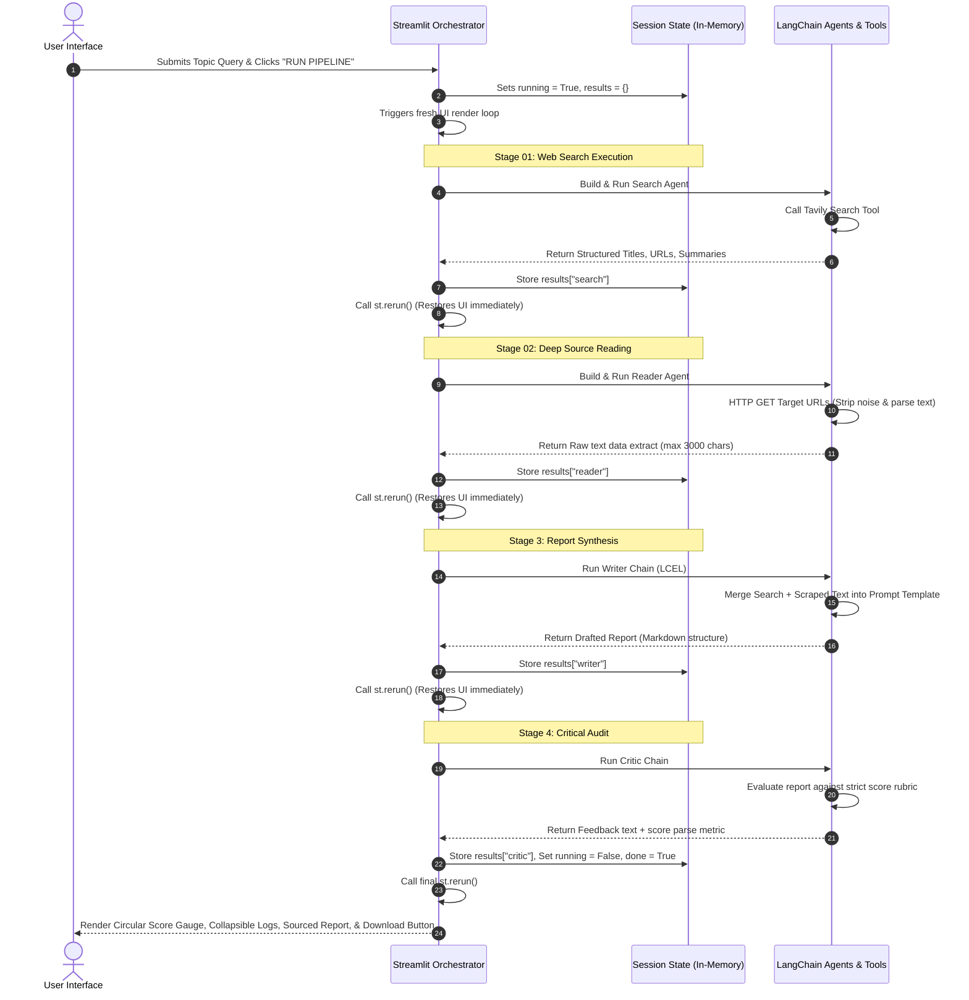

#  ResearchMind — Autonomous Multi-Agent Research System
[](https://www.python.org/) [](https://github.com/langchain-ai/langchain) [](https://streamlit.io/) [](https://mistral.ai/)
**ResearchMind** is a production-grade, distributed-agent orchestration pipeline that automates the deep research process. By connecting four specialized AI nodes on a single trace, the system automatically transitions from a user query to web search, deep HTML content extraction, professional report generation, and automated critique evaluation.
Featuring a bespoke, high-performance terminal UI themed with a bioluminescent design, ResearchMind illustrates how sequential LLM orchestration can replace manual, multi-tab information gathering with single-click sourced intelligence.
---
## 🏗️ System Architecture & Workflow
The system is designed around a decoupled, sequential agent architecture. Rather than relying on a single monolithic prompt, the workload is decomposed into four discrete, state-preserving phases.
### Agent Orchestration Flow

### The State Machine (Sequential Lifecycle Execution)

---
## 🛠️ Pipeline Stages & Node Breakdown
### 01. Search Agent (`agents.py` / `tools.py`)
* **Role**: Information Harvester.
* **Mechanism**: Utilizes `ChatMistralAI` coupled with the `TavilyClient` API.
* **Prompt Mandate**: Strictly prohibited from answering using internal LLM weights. It must use the `web_search` tool and format output as:
  ```text
  Title: [Article Title]
  URL: [Target URL]
  Summary: [Snippet Description]
  ```
### 02. Reader Agent (`agents.py` / `tools.py`)
* **Role**: Content Deep-Diver.
* **Mechanism**: Runs a robust web scraper powered by Python `requests` and `BeautifulSoup4`.
* **Token Denoising**: Automatically filters and decomposes high-noise tags (e.g., `<script>`, `<style>`, `<nav>`, `<footer>`) to maximize context-window density.
* **Output**: Extracts up to 3,000 characters of clean body text from the primary source URLs identified in the search step.
### 03. Writer Chain (`agents.py`)
* **Role**: Lead Synthesizer.
* **Mechanism**: A deterministic LangChain expression language (LCEL) chain (`writer_prompt | llm | StrOutputParser`).
* **Format**: Consolidates scraped research and formats a professional document consisting of an *Introduction*, *Key Findings* (minimum 3 deeply analyzed items), a *Conclusion*, and *Sourced References*.
### 04. Critic Chain (`agents.py`)
* **Role**: Quality Assurance.
* **Mechanism**: An independent evaluation chain that reviews the drafted report against a strict structural and factual rubric.
* **Evaluation Metrics**: Computes an objective numeric score (`Score: X/10`), highlights strengths, lists specific areas for improvement, and issues a final, one-line verdict.
---
## 💾 Technical Stack & Tooling
| Layer | Component | Description |
| :--- | :--- | :--- |
| **Core Framework** | `langchain` / `langchain-core` | Declarative agent definition, tool binding, and LLM orchestration. |
| **Language Model** | `ChatMistralAI` (`mistral-medium-3-5`) | Low-latency inference, strict template compliance, and structured returns. |
| **External Search** | `tavily-python` | Specialized developer search engine for real-time web grounding. |
| **Web Scraping** | `beautifulsoup4` / `requests` / `lxml` | Clean raw HTML processing and structural component decomposition. |
| **UI Framework** | `streamlit` | Reactive state management and customized UI components. |
| **Robustness** | `tenacity` | Adaptive back-off and retry logic for network dependencies. |
| **UX & Logging** | `rich` | Terminal visualization and pipeline tracing logs. |
---
## 📝 Production Engineering Design Logs
> [!NOTE]
> *Reflections from a Senior Production Engineer on the design constraints, architecture compromises, and robustness safeguards implemented in this codebase.*
### 1. State Preservation Over a Stateless UI (Streamlit Rerun Loop)
Streamlit executes files linearly from top-to-bottom on every user interaction or state update. Executing a long-running multi-stage AI pipeline in a single Streamlit script execution runs a high risk of browser timeouts, API blocks, or screen-freezes. 
* **The Solution**: We modeled the execution as a **state-machine execution loop**. The pipeline executes exactly **one** agent phase per script run, updates `st.session_state` with the result, and immediately triggers `st.rerun()`.
* **The Benefit**: This creates an asynchronous feel in a synchronous UI. The visual "Signal Rail" updates in real-time, showing precisely which node is active, and guarantees that if an API call fails at Stage 4, the data from Stages 1-3 is safely cached in memory rather than lost.
### 2. The Scraping Denoising Strategy & Token Economy
Raw web scraping averages 50KB to 200KB of HTML markup, navigation blocks, scripts, and CSS style rules. Passing this raw string into an LLM context is highly inefficient—wasting tokens, increasing latency, and cloud costs.
* **The Solution**: The `scrape_url` tool actively decomposes noisy subtrees:
  ```python
  for tag in soup(["script", "style", "nav", "footer"]):
      tag.decompose()
  ```
  Additionally, text extraction is sliced to the top 3,000 characters using `get_text(separator=" ", strip=True)[:3000]`. This cleans the input payload by up to 90% while keeping the primary semantic body context intact.
### 3. Graceful Network Exceptions and Boundaries
When designing agentic workflows, the outside network is the most frequent point of failure. Websites implement DDoS protection, return HTTP 403 errors, or timeout.
* **The Solution**: Inside `pipeline.py` and `tools.py`, every web scraper call is wrapped in defensive try-except blocks:
  ```python
  try:
      resp = requests.get(url, timeout=8, headers={"User-Agent": "Mozilla/5.0"})
      ...
  except Exception as e:
      return f"Could not scrape URL: {str(e)}"
  ```
  If a single site fails to scrape, the system logs the failure, saves the error boundary trace to the scraped contents pool, and moves on to the next source. A single broken network link will **never** trigger a pipeline crash.
### 4. Decoupling Synthesis and Evaluation (Writer vs. Critic)
Combining writing and editing inside a single prompt creates a confirmation bias where the LLM struggles to find issues in its own output.
* **The Solution**: Decoupled the generation stage (`WriterChain`) from the inspection stage (`CriticChain`). The Critic has a strict, separate system instruction set that forces it to act as an adversarial editor, generating a metrics dial from 0 to 100 based on a strict X/10 parsing format.
---
## ⚡ Setup & Installation
Follow these steps to deploy and run ResearchMind locally:
### 1. Clone & Set Up Directory
Navigate to the root project folder:
```bash
cd "Multi Agent Research System"
```
### 2. Configure Virtual Environment
Create and activate a clean Python virtual environment to avoid dependency conflicts:
```bash
# Create
python -m venv .venv
# Activate (Windows PowerShell)
.venv\Scripts\Activate.ps1
# Activate (macOS/Linux)
source .venv/bin/activate
```
### 3. Install Dependencies
Install all required libraries specified in the manifest:
```bash
pip install -r requirements.txt
```
### 4. Configure Environment Variables
Create a `.env` file in the root directory and insert your developer API credentials:
```env
MISTRAL_API_KEY="your_mistral_api_key_here"
TAVILY_API_KEY="your_tavily_api_key_here"
```
---
## 🚀 Execution & Usage
ResearchMind can be operated in two modes:
### Mode A: Bespoke UI (Streamlit Web Dashboard)
To run the high-fidelity web application:
```bash
streamlit run app.py
```
1. Open the URL shown in your terminal (usually `http://localhost:8501`).
2. Input a target topic (e.g., *"LLM agents breakthroughs in 2025"*).
3. Click **RUN PIPELINE**.
4. Monitor the active signal green rails as the pipeline steps from 01 to 04.
5. Review the final report, dynamic score dial, and click **Download report (.md)** to save your research locally.
### Mode B: CLI Pipeline (Lightweight Terminal Run)
To execute the pipeline directly in the terminal:
```bash
python pipeline.py
```
1. Enter your research topic in the terminal prompt.
2. Watch the step logs output information as the pipeline processes.
3. The final synthesized report and critic review will print directly to the console.
# Environment Variables (Sensitive Keys)
.env
.env.local
.env.*.local
# Virtual Environment
.venv/
venv/
ENV/
env/
# Python Compilation Cache & Bytecode
__pycache__/
*.py[cod]
*$py.class
# Testing / Coverage
.pytest_cache/
.coverage
.coverage.*
htmlcov/
.nosexy
nosetests.xml
coverage.xml
# IDEs & System files
.vscode/
.idea/
.DS_Store
Thumbs.db
# ◈ ResearchMind — Bioluminescent Multi-Agent Research System
[](https://www.python.org/)
[](https://github.com/langchain-ai/langchain)
[](https://streamlit.io/)
[](https://mistral.ai/)
**ResearchMind** is a production-grade, distributed-agent orchestration pipeline that automates the deep research process. By connecting four specialized AI nodes on a single trace, the system automatically transitions from a user query to web search, deep HTML content extraction, professional report generation, and automated critique evaluation.
Featuring a bespoke, high-performance terminal UI themed with a bioluminescent design, ResearchMind illustrates how sequential LLM orchestration can replace manual, multi-tab information gathering with single-click sourced intelligence.
---
## 🏗️ System Architecture & Workflow
The architecture decomposes a large reasoning workload into a **sequential state-machine** consisting of four specialized nodes. This separation of concerns ensures higher compliance, easier debugging, and token efficiency compared to a single monolithic prompt.
### 1. High-Level System Topology (Static Architecture)
This diagram shows how user queries flow into the orchestrator, trigger individual agents/chains in sequence, communicate with external web tools, and stream the results back to the interface:

---
### 2. Sequence Diagram (Pipeline Execution & UI Handshakes)
Streamlit is natively stateless and runs the entire python script top-to-bottom on any interaction. To prevent screen locking and execution timeouts during long LLM calls, ResearchMind employs a **dynamic state-restoring execution loop**. 
Here is the chronological lifecycle of a single research run:

---
### 3. Pipeline Agent Spec Sheet (Core Node Matrix)
The following matrix provides a clear breakdown of inputs, tools, processes, and outputs for every node:
| Stage | Node Name | Input | Tooling & Integration | Core Logic / Prompt Rules | Output |
| :---: | :--- | :--- | :--- | :--- | :--- |
| **01** | **Search Agent** | User Topic string | `TavilyClient` Web Search | Queries the web for recent info. Forbidden from using internal LLM knowledge. | Strict format block:<br>`Title: ...`<br>`URL: ...`<br>`Summary: ...` |
| **02** | **Reader Agent** | Sourced URLs | `BeautifulSoup4` + `requests` | Extracts web pages, strips style/script/nav/footer tags, and slices output to prevent context bloat. | Clean body text summaries (max 3000 chars) |
| **03** | **Writer Chain** | Topic + Search Results + Scraped Content | LangChain Expression Language (LCEL) | Synthesizes source data into a formal document with an Intro, 3 detailed Findings, and Sources list. | Synthesized Markdown Report document |
| **04** | **Critic Chain** | Drafted Markdown Report | LCEL Evaluation Template | Evaluates the draft report. Computes score, lists strengths, notes gaps, and issues a final verdict. | Structured Score Block:<br>`Score: X/10`<br>`Strengths:`<br>`Improvements:` |
---
## ⚡ Interactive Feature Showreel & UI Layout
Click the dropdowns below to inspect how key aspects of the system look, behave, and maintain operational stability:
<details>
<summary><b>🟢 Interactive Terminal UI (Bespoke Streamlit Theme)</b></summary>
The UI is styled using custom injected CSS rules to simulate a live developer terminal panel:
- **Palette**: Dark graphite background (`#07080a`), bioluminescent signal green (`#39ffb0`) for active flows, and signal pink (`#ff3d8a`) for the critic panel.
- **Micro-Animations**: Hover glowing states, flicker effects on header text, and circular progress gauges.
- **Layout**: Double-column dashboard (Left: query console and output logs; Right: live "Signal Rail" tracking nodes).
</details>
<details>
<summary><b>📄 Example Pipeline Console Output (Live CLI Execution Trace)</b></summary>
When running `python pipeline.py`, the console outputs a clear trace showing step transitions:
```text
==================================================
step 1 - search agent is working ...
==================================================
search result:
Title: Quantum Computing Advancements 2025
URL: https://example-quantum-news.com/breakthroughs-2025
Summary: IBM and Google achieve 1000-qubit error-mitigated computations...
==================================================
step 2 - Reader agent is scraping top resources ...
==================================================
🔗 Scraping URL 1: https://example-quantum-news.com/breakthroughs-2025
Scraped Content:
Source: https://example-quantum-news.com/breakthroughs-2025
IBM Quantum System Two deployed with error mitigation algorithms...
==================================================
step 3 - Writer is drafting the report ...
==================================================
Final Report:
# Report: Quantum Computing Advancements 2025
## Introduction ...
==================================================
step 4 - critic is reviewing the report
==================================================
Critic Report:
Score: 8/10
Strengths:
- Accurately cites raw source URL links.
- Key findings are clearly mapped out.
Areas to Improve:
- Provide more detail on the error-mitigation formulas.
One line verdict: Excellent grounded review with minimal filler text.
```
</details>
<details>
<summary><b>🧠 Recruiter FAQ (Interactive Architectural Decisions)</b></summary>
### Q: Why use a multi-agent loop instead of single-shot prompting?
A single-prompt request asking an LLM to search, scrape, write, and critique at once degrades quality. LLMs suffer from attention dilution. By isolating tasks (Stage 1 searches, Stage 2 extracts text, Stage 3 writes, Stage 4 evaluates), we ensure each component performs a singular task perfectly.
### Q: How does the system handle website blocks and slow page loads?
The `scrape_url` tool is wrapped inside strict error insulation barriers. We set connection timeouts (`timeout=8`) and pass standard headers (`User-Agent: Mozilla/5.0`) to avoid bot detection. If a page fails to respond, the system catches the exception and logs it, allowing the remaining pipeline to proceed uninterrupted.
### Q: How is the critic score parsed and displayed in the UI?
The `CriticChain` returns a structured output featuring `Score: X/10`. We execute regex parsing in `app.py`:
```python
re.search(r"(?:score|rating)\s*[:\-]?\s*(\d{1,3})\s*/\s*10", critic_text)
```
This score is extracted, normalized to a percentage scale (0-100), and dynamically bound to an inline SVG progress circle that spins and changes color depending on the score tier.
</details>
---
## 📝 Production Engineering Design Logs
> [!NOTE]
> *Reflections from a Senior Production Engineer on the design constraints, architecture compromises, and robustness safeguards implemented in this codebase.*
### 1. State Preservation Over a Stateless UI (Streamlit Rerun Loop)
Streamlit executes files linearly from top-to-bottom on every user interaction or state update. Executing a long-running multi-stage AI pipeline in a single Streamlit script execution runs a high risk of browser timeouts, API blocks, or screen-freezes. 
* **The Solution**: We modeled the execution as a **state-machine execution loop**. The pipeline executes exactly **one** agent phase per script run, updates `st.session_state` with the result, and immediately triggers `st.rerun()`.
* **The Benefit**: This creates an asynchronous feel in a synchronous UI. The visual "Signal Rail" updates in real-time, showing precisely which node is active, and guarantees that if an API call fails at Stage 4, the data from Stages 1-3 is safely cached in memory rather than lost.
### 2. The Scraping Denoising Strategy & Token Economy
Raw web scraping averages 50KB to 200KB of HTML markup, navigation blocks, scripts, and CSS style rules. Passing this raw string into an LLM context is highly inefficient—wasting tokens, increasing latency, and cloud costs.
* **The Solution**: The `scrape_url` tool actively decomposes noisy subtrees:
  ```python
  for tag in soup(["script", "style", "nav", "footer"]):
      tag.decompose()
  ```
  Additionally, text extraction is sliced to the top 3,000 characters using `get_text(separator=" ", strip=True)[:3000]`. This cleans the input payload by up to 90% while keeping the primary semantic body context intact.
### 3. Graceful Network Exceptions and Boundaries
When designing agentic workflows, the outside network is the most frequent point of failure. Websites implement DDoS protection, return HTTP 403 errors, or timeout.
* **The Solution**: Inside `pipeline.py` and `tools.py`, every web scraper call is wrapped in defensive try-except blocks:
  ```python
  try:
      resp = requests.get(url, timeout=8, headers={"User-Agent": "Mozilla/5.0"})
      ...
  except Exception as e:
      return f"Could not scrape URL: {str(e)}"
  ```
  If a single site fails to scrape, the system logs the failure, saves the error boundary trace to the scraped contents pool, and moves on to the next source. A single broken network link will **never** trigger a pipeline crash.
### 4. Decoupling Synthesis and Evaluation (Writer vs. Critic)
Combining writing and editing inside a single prompt creates a confirmation bias where the LLM struggles to find issues in its own output.
* **The Solution**: Decoupled the generation stage (`WriterChain`) from the inspection stage (`CriticChain`). The Critic has a strict, separate system instruction set that forces it to act as an adversarial editor, generating a metrics dial from 0 to 100 based on a strict X/10 parsing format.
---
## ⚡ Setup & Installation
Follow these steps to deploy and run ResearchMind locally:
### 1. Clone & Set Up Directory
Navigate to the root project folder:
```bash
cd "Multi Agent Research System"
```
### 2. Configure Virtual Environment
Create and activate a clean Python virtual environment to avoid dependency conflicts:
```bash
# Create
python -m venv .venv
# Activate (Windows PowerShell)
.venv\Scripts\Activate.ps1
# Activate (macOS/Linux)
source .venv/bin/activate
```
### 3. Install Dependencies
Install all required libraries specified in the manifest:
```bash
pip install -r requirements.txt
```
### 4. Configure Environment Variables
Create a `.env` file in the root directory and insert your developer API credentials:
```env
MISTRAL_API_KEY="your_mistral_api_key_here"
TAVILY_API_KEY="your_tavily_api_key_here"
```
---
## 🚀 Execution & Usage
ResearchMind can be operated in two modes:
### Mode A: Bespoke UI (Streamlit Web Dashboard)
To run the high-fidelity web application:
```bash
streamlit run app.py
```
1. Open the URL shown in your terminal (usually `http://localhost:8501`).
2. Input a target topic (e.g., *"LLM agents breakthroughs in 2025"*).
3. Click **RUN PIPELINE**.
4. Monitor the active signal green rails as the pipeline steps from 01 to 04.
5. Review the final report, dynamic score dial, and click **Download report (.md)** to save your research locally.
### Mode B: CLI Pipeline (Terminal Run)
To execute the pipeline directly in the terminal:
```bash
python pipeline.py
```
1. Enter your research topic in the terminal prompt.
2. Watch the step logs output information as the pipeline processes.
3. The final synthesized report and critic review will print directly to the console.
